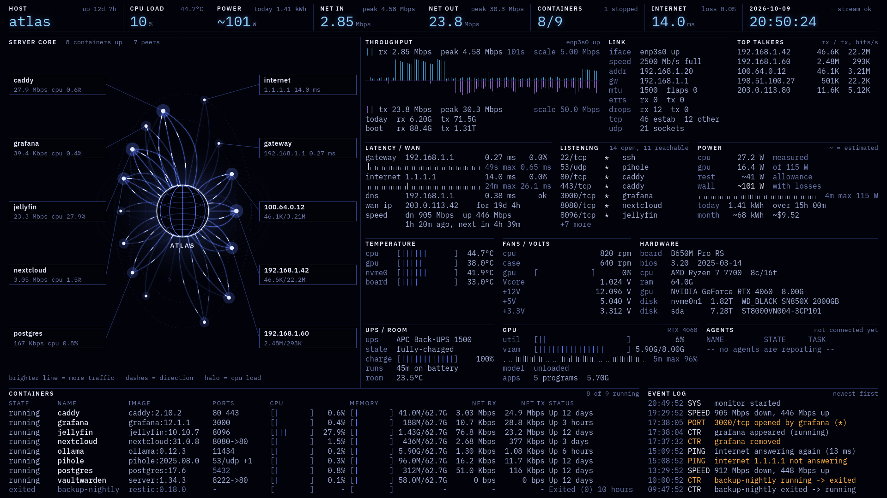
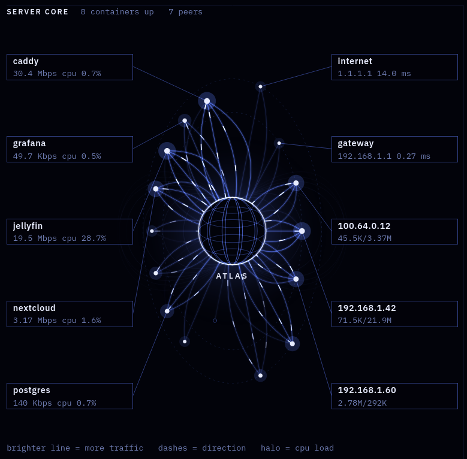
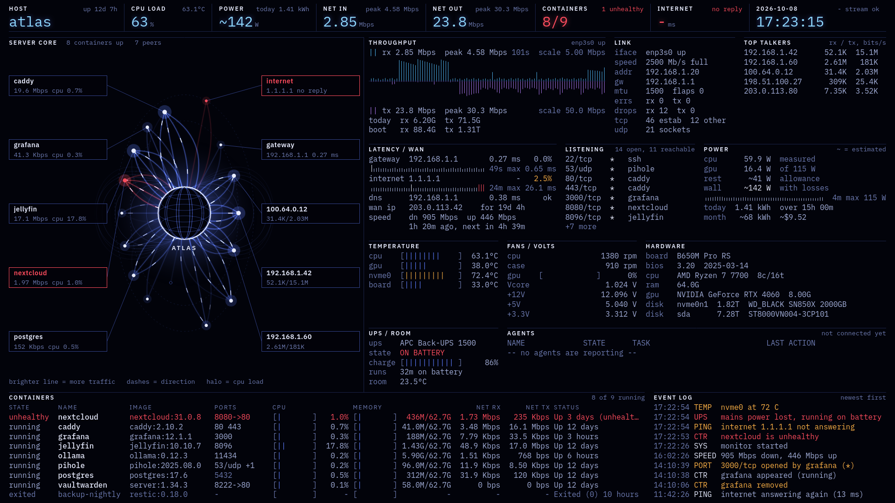

# Rack Dashboard

A one-page status screen for a home server, built to sit full screen on a small monitor in the rack. It shows the Docker containers, network, power and hardware of the machine it runs on and refreshes every second.
No this dashboard doesn't fix anything. But clueless relatives might call you a cybercriminal from now on.



The backend is Python (FastAPI) and reads everything from the local machine. The page is plain HTML, CSS and JavaScript with no build step. Linux only.

The screenshots here were taken with made-up containers and addresses.

## What is on the screen

The top row holds the numbers worth reading from across the room: host and uptime, CPU load and temperature, power draw, network in and out, containers running, internet latency and the clock.

On the left, the server is drawn as a globe with a line to everything it is talking to. Containers sit on one side and network peers on the other. A thicker, brighter bundle of lines means more traffic (log scale, 1 Kbps to 1 Gbps), the dashes travel the way most of the data is going, and the halo around the globe follows CPU load. The five busiest or most troubled things on each side get a label.



The rest of the page is detail:

| Section | Shows |
| --- | --- |
| Throughput | Receive and transmit rate of the main interface with recent history and peaks, plus totals for today and since boot |
| Link | Interface state, speed, address, gateway, error and drop counters, socket counts |
| Top talkers | The remote hosts moving the most data, taken from the kernel's per-connection byte counters (TCP only) |
| Latency / WAN | Ping to the gateway and to an outside address, DNS lookup time, public IP and how long it has been held, last speed test |
| Listening | Open ports, what owns them, and whether they can be reached from the network or only from the machine itself |
| Power | CPU and GPU watts, an estimate of the draw at the wall, energy today and this month, and the cost if a price is set |
| Temperature, Fans / volts | Whatever `hwmon` and `nvidia-smi` report |
| Hardware | Board, BIOS, CPU, memory, GPU, disks |
| UPS / room | A USB UPS known to `upower`, and an optional room temperature sensor |
| Containers | State, image, ports, CPU, memory and network rate for each container. There is room for nine; past that, the uneventful ones are summed up in a last line |
| Event log | What changed: containers stopping, ports opening, pings going unanswered, temperature limits crossed, the UPS switching to battery |

The Agents section is a placeholder and shows nothing yet.

## When something is wrong

Colour is kept for trouble. A healthy system is blue and white only. Amber and red appear when something needs attention, and they appear in every place that thing is shown, so an unhealthy container turns red in the top row, in the centrepiece, in the table and in the log at once.



If the page loses its connection to the backend, every reading is dimmed so that old numbers cannot pass for live ones.

## Requirements

- Linux. Developed and tested on Ubuntu 26.04 with Python 3.14.
- Docker, with its socket readable by the user that runs the dashboard. Tested with Docker Desktop for Linux; a normal Docker Engine socket at `/var/run/docker.sock` is tried first. Without Docker the page still runs and says so.
- `ss` from iproute2, which practically every distribution ships.
- Optional: `nvidia-smi` for GPU readings and `upower` for a UPS.
- A current Firefox or Chromium-based browser.

Pings use unprivileged ICMP sockets. Ubuntu allows these by default; elsewhere check `net.ipv4.ping_group_range`.

## Running it

```bash
git clone https://github.com/nprev-dev/Docker-UI-app.git
cd Docker-UI-app
python3 -m venv .venv
.venv/bin/pip install -r requirements.txt
./run.sh
```

Then open <http://127.0.0.1:8787>. For a monitor in the rack, start the browser in kiosk mode, for example `firefox --kiosk http://127.0.0.1:8787`.

The layout is made for a 16:9 screen. Text size follows the window, and the page has been checked from 1366x768 up to 4K.

There is no login. By default the server listens on localhost only. Setting `DASH_HOST=0.0.0.0` makes the page reachable from other machines, and with it your open ports, addresses and container names, so do that only on a network you trust.

## Settings

Everything is set through environment variables, for example `DASH_KWH_PRICE=0.14 ./run.sh`.

| Variable | Default | Meaning |
| --- | --- | --- |
| `DASH_HOST` | `127.0.0.1` | Address the server listens on |
| `DASH_PORT` | `8787` | Port |
| `DASH_INTERVAL` | `1` | Seconds between updates |
| `DOCKER_HOST` | unset | Docker socket to use. Unset, it tries `/var/run/docker.sock`, then Docker Desktop's socket in the home directory |
| `DASH_IFACE` | unset | Network interface to watch. Unset, the one holding the default route |
| `DASH_PING_TARGET` | `1.1.1.1` | Outside address to ping |
| `DASH_PING_INTERVAL` | `30` | Seconds between those pings |
| `DASH_DNS_NAME` | `example.com` | Name looked up to time DNS |
| `DASH_SPEEDTEST_HOURS` | `6` | Hours between speed tests, `0` for none |
| `DASH_PROBES` | `1` | `0` stops the dashboard from sending anything onto the network |
| `DASH_KWH_PRICE` | unset | Price of a kilowatt-hour. Set it to get a monthly cost |
| `DASH_CURRENCY` | `$` | Symbol shown with the cost |
| `DASH_POWER_BASE_W` | unset | Watts for everything that has no power sensor. Unset, a built-in allowance is used |
| `DASH_PSU_EFFICIENCY` | `0.87` | Power supply efficiency used for the wall figure |
| `DASH_CPU_IDLE_W`, `DASH_CPU_MAX_W` | `25`, `142` | CPU power at idle and at full load, used only while it cannot be measured |
| `DASH_ROOM_SENSOR` | unset | Path of a file holding a temperature, as 1-wire and USB sensors provide |
| `DASH_STATE` | `data/state.json` | Where totals and history are kept between restarts |

## What it sends over the network

Everything on the page is read from the machine itself, except for the checks below. With the default settings the dashboard sends:

- a ping to the default gateway every second
- a ping to `DASH_PING_TARGET` every 30 seconds
- a DNS lookup of `DASH_DNS_NAME` every 5 seconds, to the resolvers the system already uses
- one HTTPS request to `1.1.1.1/cdn-cgi/trace` every 10 minutes, to learn the public IP
- a Cloudflare speed test every 6 hours, which moves up to about 75 MB each time

`DASH_PROBES=0` turns all of it off, and `DASH_SPEEDTEST_HOURS=0` turns off only the speed test.

`data/state.json` holds the daily totals, speed test history, the event log and your public IP address. That last one is the reason `data/` is in `.gitignore`.

## About the power figures

There is no power meter involved. GPU power comes from `nvidia-smi`. CPU power is measured when the kernel's energy counter can be read and estimated from load when it cannot. Board, memory, disks and fans are a fixed allowance. The sum is then divided by the efficiency of the voltage regulators and the power supply to get a figure for the wall. Anything that is an estimate is marked with `~` on the screen.

Treat the wall figure as the right ballpark, not a measurement. If you have a metering plug, compare once and adjust `DASH_POWER_BASE_W` and `DASH_PSU_EFFICIENCY` until they agree.

Two optional steps give better readings. Both are undone by a reboot.

```bash
# Let ordinary users read the CPU energy counter. Kernels have kept it root-only since the
# PLATYPUS side-channel attack, so decide for yourself whether that matters on your machine.
sudo chmod a+r /sys/class/powercap/intel-rapl:0/energy_uj

# Fan speeds and voltages need the driver for the board's sensor chip. nct6775 covers many
# ASUS and ASRock boards; sensors-detect from lm-sensors will tell you which one yours needs.
sudo modprobe nct6775
```

## How it is put together

```
backend/     FastAPI app. Three collectors (containers, network, hardware) run once a second
             and the result is pushed to every open page over Server-Sent Events.
frontend/    The page: ES modules, canvas for the graphs and the centrepiece, no framework.
tests/       pytest suite, plus checks of the animation logic.
```

`GET /api/snapshot` returns the latest reading as JSON and `GET /api/stream` is the live stream, in case you want the data for something else.

## Tests

```bash
.venv/bin/pip install -r requirements-dev.txt
.venv/bin/python -m pytest
```

The checks of the animation logic are written in JavaScript and run under `gjs`, which GNOME desktops have installed. Without it that one test is skipped.

## Not done yet

- The Agents section is empty.
- Nothing about GPU workloads or loaded AI models.
- No view of the switch ports.
- It has only ever run on one machine (AMD CPU, NVIDIA GPU). Other hardware will probably leave gaps in the power, temperature and fan sections.

## Fonts

IBM Plex Sans and IBM Plex Mono are bundled under the SIL Open Font License. The licence text is in `frontend/fonts/LICENSE.txt`.
